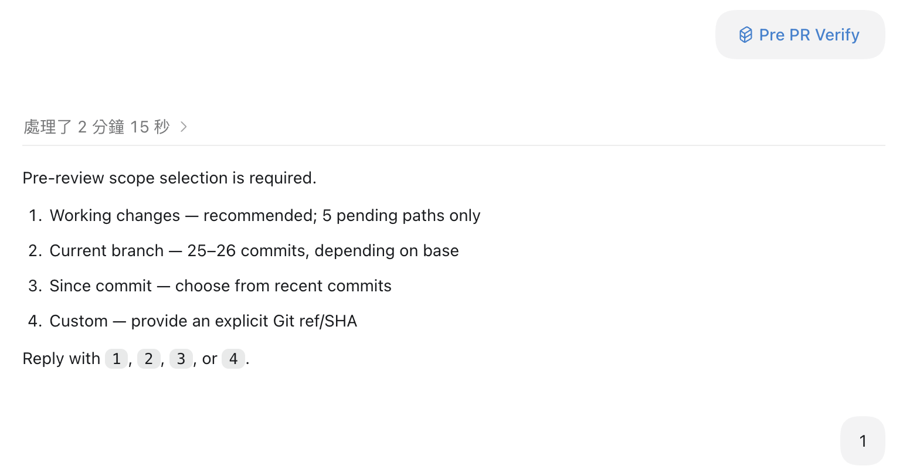
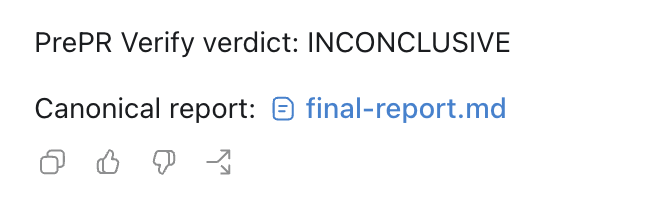
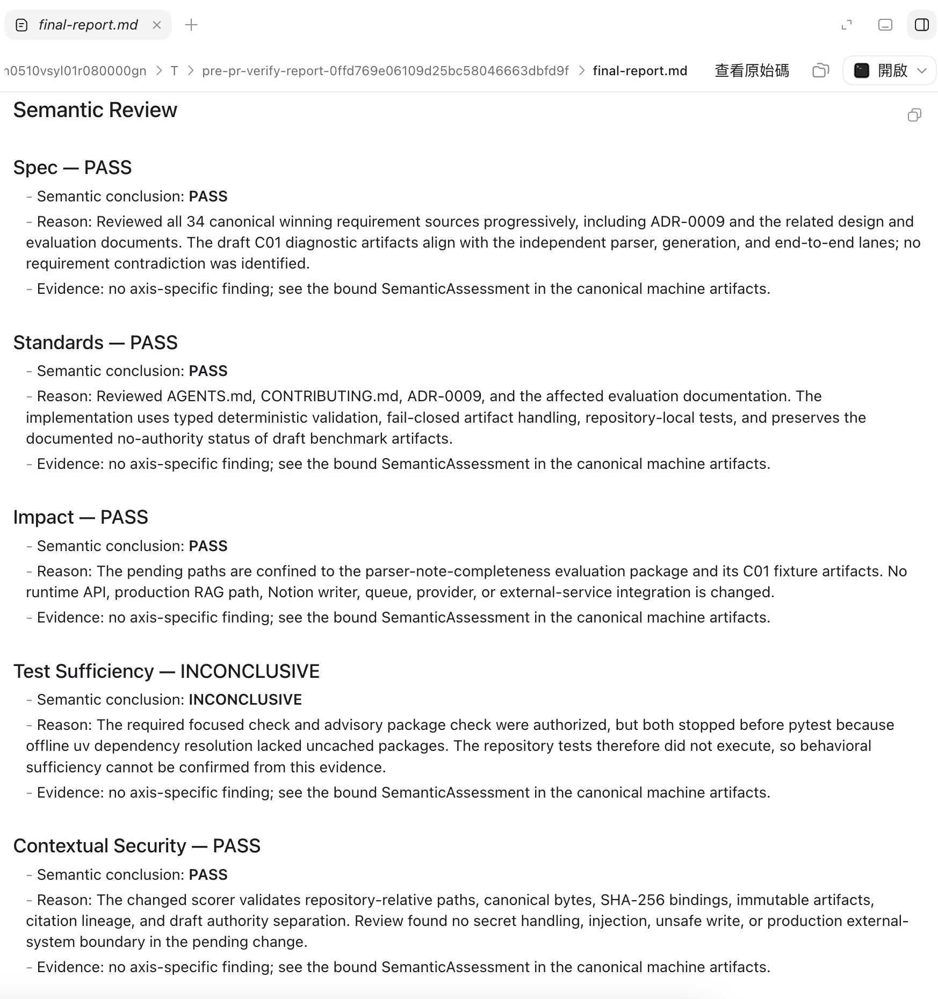

# PrePR Verify

PrePR Verify is an independent, evidence-based pre-PR verification Skill for AI-assisted software development. A fresh reviewer reconstructs context from repository state instead of trusting the implementation session's claim that the work is complete.

The product is an **Agent Skill + deterministic Python core**. The Skill owns
semantic judgment and workflow orchestration. The core owns Git scope, typed
artifacts, command contracts, evidence references, schema validation, and verdict
invariants.

## Review model

Every full review keeps three concerns separate:

- **Spec:** Did we build the right thing?
- **Standards:** Did we build it the right way for this repository?
- **Verification:** Can deterministic evidence prove it works?

The canonical semantic and reduced axes are **Spec**, **Standards**, **Impact**,
**Test Sufficiency**, and **Contextual Security**. Each is `PASS`, `FAIL`, or
`INCONCLUSIVE`. Verification remains separate evidence; its outcomes and gaps
propagate into the axes and final verdict. The final verdict is `READY`,
`NEEDS_CHANGES`, or `INCONCLUSIVE`. Missing required evidence never produces
`READY`.

Semantic review examines implementation logic, contract mismatches, affected
callers, edge and error paths, and missing-test risk. Passing tests are evidence, not proof that the implementation is correct.

The full review flow is:

```text
explicit review scope
→ requirement / standards discovery
→ impact-aware verification planning
→ authorized disposable execution
→ senior-style semantic review
→ deterministic evidence reduction
→ READY / NEEDS_CHANGES / INCONCLUSIVE
```

## What a Review Looks Like

Before execution, the reviewer explicitly confirms the review scope,
requirement and Standards sources, verification plan, and final execution
confirmation.



The completed review reports Spec, Standards, Impact, Test Sufficiency, and
Contextual Security, followed by a final `READY`, `NEEDS_CHANGES`, or
`INCONCLUSIVE` verdict.



Each axis keeps a concise semantic rationale. Verification failures remain
separate evidence, confirmed blocking findings remain explicit, and unresolved
evidence gaps remain visible.



## Version boundaries

- **V1:** local independent review and deterministic verification core.
- **V2:** user-initiated GitHub PR review through GitHub MCP, with approval-gated top-level publication.
- **V3:** authorized event trigger and deterministic inline mapping. MCP remains an integration interface, not the trigger.

V1 is the implemented local product. The latest tagged release is `v0.1.8`.
Current `main` also contains unreleased cross-host Agent Skill support for
OpenAI Codex and Claude Code planned for `v0.1.9`. V2/V3 remain unimplemented.
The repository's release-readiness checks cover the complete local workflow,
installability, Skill instructions, acceptance scenarios, and self-hosting
evidence.

## Install and use the Skill

Install the same repository as an Agent Skill checkout, then install its locked
Python core. The supported local Skill hosts are OpenAI Codex and Claude Code.

### OpenAI Codex

```sh
git clone https://github.com/rileylai/pre-pr-verify.git \
  ~/.codex/skills/pre-pr-verify
cd ~/.codex/skills/pre-pr-verify
uv sync --locked
```

Invoke it as `$pre-pr-verify` in a human-attached Codex session.

### Claude Code

```sh
git clone https://github.com/rileylai/pre-pr-verify.git \
  ~/.claude/skills/pre-pr-verify
cd ~/.claude/skills/pre-pr-verify
uv sync --locked
```

Invoke the same Skill as `/pre-pr-verify` in a human-attached Claude Code
session. Both layouts use the same root `SKILL.md`, deterministic Python core,
and review workflow; host-provided semantic reasoning may differ.

In either host, invoke the same Skill with a repository and select one of the
displayed scope intents and boundaries. For Codex, for example:

```text
Use $pre-pr-verify to review /path/to/repository. I want current branch scope;
show me the bounded base candidates before I choose one.
Treat docs/feature-spec.md as the explicit requirement.
```

In Claude Code, use `/pre-pr-verify` in the first line instead.

Interactive reviews use explicit scope, requirement, verification
authorization, and final-confirmation steps. Recommendations and previews are
advisory, repository commands never grant execution authority, and headless
invocations fail preflight when required inputs are missing. The reviewer
examines the complete winning requirement set; presentation and comparison
bounds do not silently select or drop candidates.

The detailed chooser mechanics, candidate presentation, authorization handoff,
and interaction sequencing are defined in the
[`docs/09_v1_skill_runbook.md`](docs/09_v1_skill_runbook.md) runbook.

The root `SKILL.md` is the full-review entrypoint. It orchestrates the canonical
Python builders/loaders for ChangeSet, discovery, planning/execution,
SemanticAssessment, ReviewArtifact, report, and exit semantics. The standalone
CLI intentionally exposes only deterministic capture; it is not a prompt-free
semantic-review command.
A bare `$pre-pr-verify` invocation performs real senior-style semantic inspection;
green verification is evidence and does not substitute for that review.
The exact full-review imports and call sequence are in
[`docs/09_v1_skill_runbook.md`](docs/09_v1_skill_runbook.md).

The default Markdown report includes a concise `Semantic Review` section for
all five axes, showing the final axis status, the semantic conclusion, the
review rationale, and stable finding references. Verification results remain
visible as separate evidence; passing checks do not replace semantic review.
Canonical machine artifacts remain authoritative. A confirmed verification
failure may block readiness, while a required check without reliable attribution
or evidence remains `INCONCLUSIVE`; a nonzero process status alone is not a
candidate regression.

## Development

The package supports Python 3.11 or newer. Reproducible development is pinned to
uv-managed CPython 3.12.13 through `.python-version`.

```sh
uv sync --locked --dev
uv run pytest
uv build
```

To validate the built core independently of the source checkout:

```sh
uv venv /tmp/pre-pr-verify-install
uv pip install --python /tmp/pre-pr-verify-install/bin/python \
  dist/pre_pr_verify-0.1.8-py3-none-any.whl
/tmp/pre-pr-verify-install/bin/python -c \
  "import pre_pr_verify; print(pre_pr_verify.__version__)"
```

The wheel/sdist are the Python core distribution. The Git checkout is the Agent
Skill distribution and therefore contains `SKILL.md`, numbered references, and
checked-in schemas.

The deterministic capture CLI is:

```sh
uv run pre-pr-verify capture \
  --repo /path/to/repository \
  --base main \
  --scope pending
```

The command writes canonical ChangeSet JSON to stdout unless `--output` is
explicitly supplied. It performs no semantic review and emits no readiness
verdict. The installed Python core provides every V1 contract and canonical
builder/loader; checked-in schemas live under `schemas/`, and installed code can
render the same schemas through `pre_pr_verify.schema`.
Installed or copied cores can obtain truthful build provenance without Git via
`pre_pr_verify.build_identity.installed_core_identity()`. Review callers supply
that value independently to both ReviewArtifact construction and loading.

Target repositories that want to declare canonical local checks may opt into
the existing `[tool.pre-pr-verify.verification]` table in `pyproject.toml`.
Without a declaration or other repository-native guidance, PrePR Verify does
not invent language-default commands; declarations remain candidates and never
grant execution authority.

No `.env`, provider API key, provider-specific token management, or network
service is required by the deterministic core or default test suite.

## Intentional V1 limits

- Local macOS/Linux Git repositories only; Windows is deferred.
- Explicit-value output redaction is bounded and best-effort.
- No provider/model token or context-window policy.
- No dependency/runtime provisioning or universal package-manager support.
- No language-specific AST/dependency engine.
- No scanner auto-installation.
- No inferred monorepo dependency engine or enterprise policy engine.
- No GitHub MCP, GitHub PR publication, event trigger, auto-merge, V2, or V3 behavior.

## Documentation

Start with `AGENTS.md`, then follow its task-specific documentation map. Design contracts live in numbered files under `docs/`.
