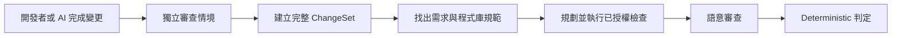
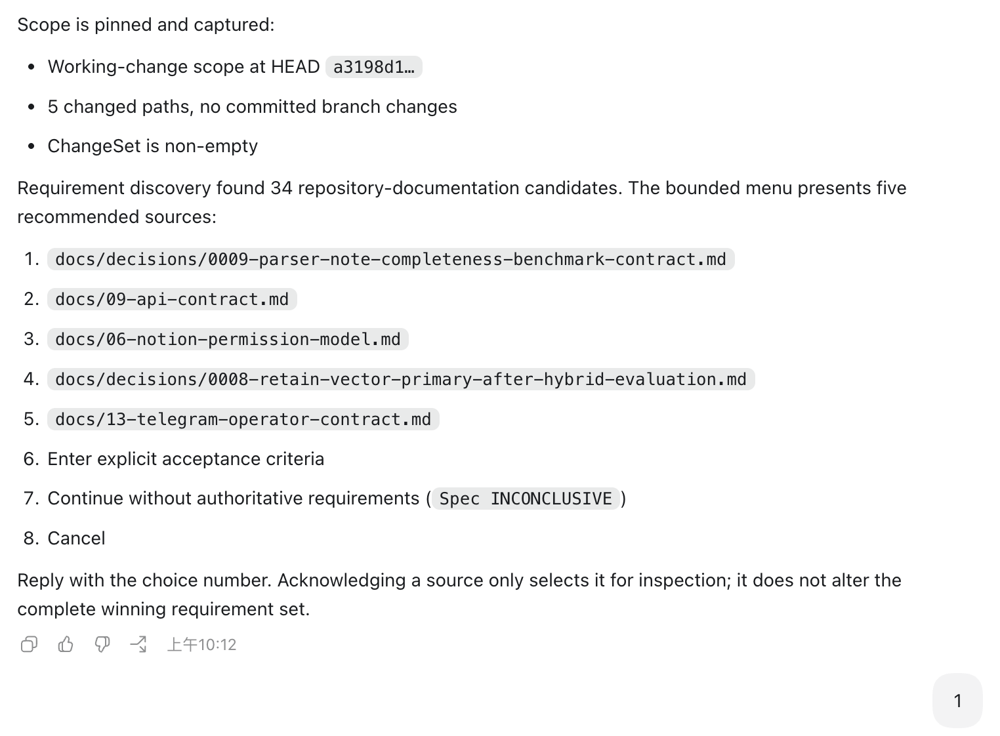
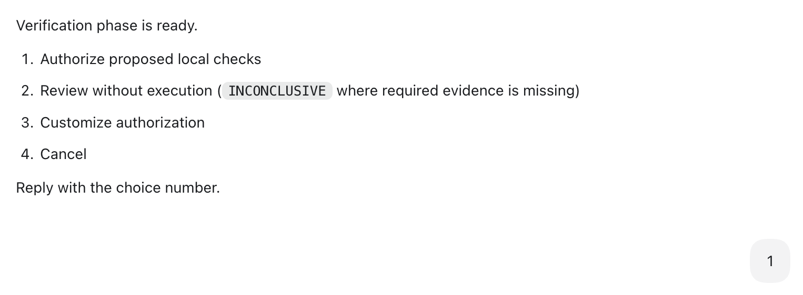
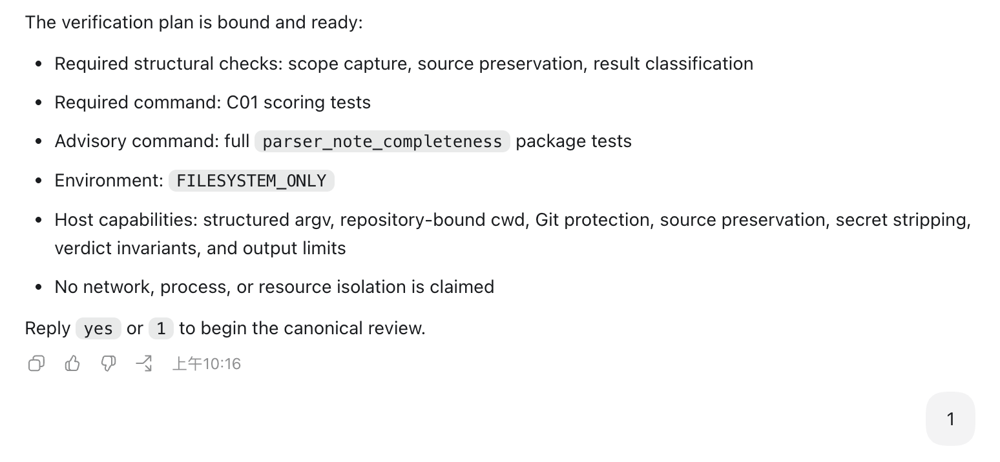
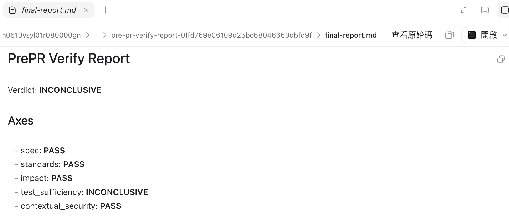
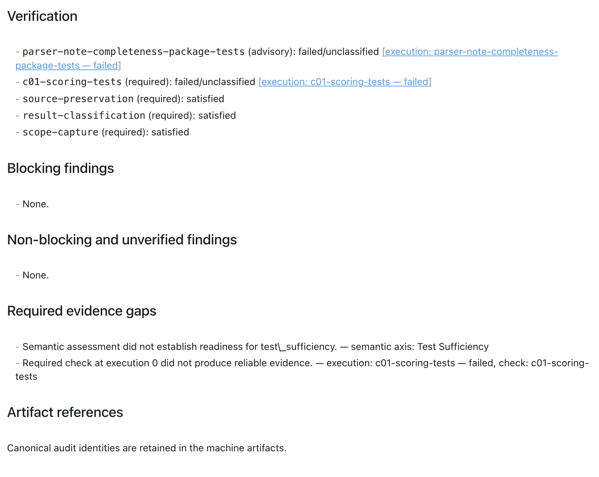
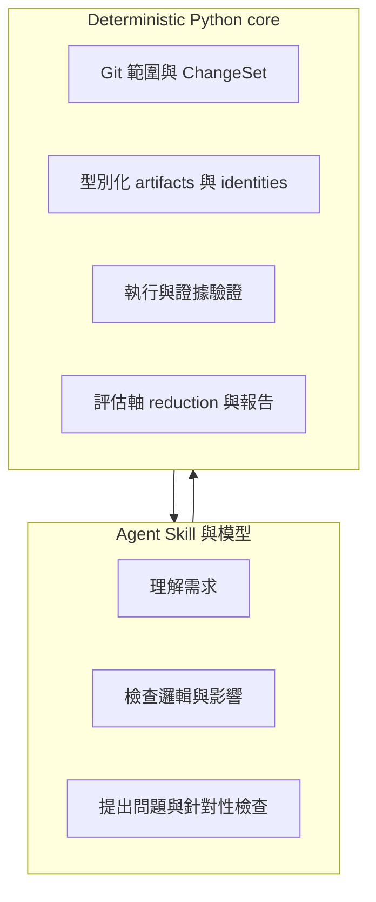
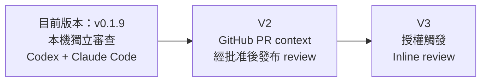

# PrePR Verify
## Product & Technical Case Study

> From AI-generated changes to evidence-backed pre-PR readiness

## 1. PrePR Verify 是什麼

PrePR Verify 是用於 PR 前檢查的 Agent Skill，服務使用 AI coding agent 的開發者。實作完成後，它會在獨立的審查情境中重新讀取程式庫狀態、需求、程式碼與測試，檢查實作邏輯、邊界與錯誤情況、契約不一致、影響範圍和測試缺口。

這個流程處理一個常見盲點：負責實作的工作階段已經投入大量推理，也跑過部分測試，容易沿用自己的假設。PrePR Verify 不採信前一個工作階段宣稱的完成狀態，會從目前的 Git 與檔案內容重新建立審查範圍。使用時機是在功能完成、準備開 PR 之前。

LLM 負責需要語意理解的程式審查；deterministic Python core 負責 Git 範圍、驗證執行、證據綁定和最終判定。輸出包含五個評估軸、具體問題、證據缺口和一份 Markdown 報告。

### PrePR Verify 審查流程

### 實際使用流程

使用 PrePR Verify 時，開發者不需要先準備完整的 review prompt。Skill 會依序確認審查範圍、需求來源與要執行的檢查，再要求一次最終確認。完成後會產生 `READY`、`NEEDS_CHANGES` 或 `INCONCLUSIVE` verdict，並附上一份可閱讀的報告。

整個流程讓重要決策由使用者確認，包括 review 哪個範圍、是否執行測試，以及採用哪些 verification checks。程式庫中的文件或指令可以提供審查依據，但不會自行取得執行權限。

最終報告除了 verdict，也會列出五個評估軸的結果、語意審查理由、實際執行的 verification，以及 blocking findings 和 evidence gaps。使用者可以直接看出問題出在哪裡，以及下一步應該修程式、補測試，還是補齊環境或需求資訊。

#### 圖 1｜選擇本次 Review Scope

#### 圖 2｜確認需求與規範來源

#### 圖 3｜確認 Verification Plan

#### 圖 4｜執行前的最終確認

#### 圖 5｜取得 Verdict 與完整 Review Report

#### 圖 6｜五個評估軸的 Review 結果

#### 圖 7｜Semantic Review：每個 Axis 都保留判斷理由

#### 圖 8｜Verification、Blocking Finding 與 Evidence Gap

## 2. 核心設計

### 獨立審查與五個評估軸

PrePR Verify 會閱讀完整變更、相鄰程式碼和受影響的呼叫端。資深工程師式語意審查關注分支與狀態轉換、排序與備援行為、錯誤路徑、API 或資料格式相容性，以及現有測試能否證明新行為。安全審查只檢查這次變更實際碰到的信任、驗證、授權、路徑或指令執行邊界，不加入泛用安全清單。

審查分為五個 axes。`Spec` 檢查需求是否實作正確；`Standards` 檢查程式庫內的強制規範；`Impact` 檢查呼叫端、相鄰元件與既有行為；`Test Sufficiency` 評估主要成功、錯誤和邊界情況是否有測試；`Contextual Security` 檢查和變更有關的安全邊界。每個 axis 都要有簡短理由，沒有具體問題不會自動成為 PASS。通過的測試只證明選定指令成功執行，不能取代這五項檢查。

### LLM 與 deterministic core

| Responsibility | LLM / Skill | Deterministic core |
| --- | ---: | ---: |
| 理解需求、程式邏輯與影響範圍 | ✓ | |
| 提出 findings 與針對性檢查 | ✓ | |
| 固定 Git scope 和 artifact identity | | ✓ |
| 驗證 evidence references | | ✓ |
| 依規則產生 final verdict | | ✓ |

這個分工保留 LLM 在程式審查上的彈性，同時固定容易漂移的部分。Core 會驗證 finding 引用的來源、路徑、檢查或執行記錄是否真的存在，也會確認 ChangeSet、`VerificationPlan`、`VerificationEvidence`、`SemanticAssessment` 和 `ReviewArtifact` 屬於同一次審查。Schema validation 無法證明模型的語意結論必然正確，但可以拒絕錯配的證據與不符合 reducer 規則的結果。

各 artifact 有自己的 schema version，沒有全專案共用的版本號。這讓 ChangeSet 或 ReviewArtifact 可以獨立演進，也縮小相容性變更的影響範圍。Loader 遇到不支援的版本會停止，不會猜測資料該如何遷移。

### Repository-native verification 與 fail-closed verdict

PrePR Verify 先從程式庫既有工具、文件或 trusted policy 找出標準檢查，再依變更風險提出針對性檢查。它不根據語言或副檔名猜測指令矩陣，也不自動安裝掃描工具或 dependencies。找不到可靠指令時，報告會保留限制。

找到指令不代表取得執行授權。使用者先看完整 `VerificationPlan` 與執行能力，再決定執行、調整或只做靜態審查。獲得授權後，每個指令都在新的一次性環境中執行，避免污染作者的 working tree、index 和 HEAD。

執行狀態和失敗歸因也分開記錄。`failed` 或 `timed_out` 描述程序發生什麼；`verification`、`configuration`、`infrastructure`、`permission` 和 `unclassified` 說明它對候選變更代表什麼。只有具備可靠歸因的 required verification failure 才能直接證明變更失敗。

Reducer 的規則很小：任何 axis 有已確認的 blocker，結果就是 `NEEDS_CHANGES`；沒有 blocker，但任何必要證據不足，結果是 `INCONCLUSIVE`；只有五個 axes 都完成且通過，才會得到 `READY`。風險分析可以影響檢查計畫，不能改寫這組規則。

## 3. 競品研究與設計取捨

早期研究聚焦在程式審查流程。以下四個方案有足夠原始資料，也直接影響了產品邊界。

| 參考方案 | 我採用的觀念 | PrePR Verify 的調整 |
| --- | --- | --- |
| Matt Pocock `code-review` | 固定比較點，分開 Spec 與 Standards | 擴充為五軸審查，加入執行證據和 deterministic verdict |
| SteveVitali `self-review` | 新的審查情境、工具驗證、完整閱讀變更檔案和相鄰程式碼 | V1 保持 read-only，由作者處理修正，不讓 reviewer 自動 commit 或 push |
| Warp `review-pr` | 結構化 artifact、JSON Schema、finding 對應具體來源 | 先用於本機審查；GitHub publication 和 inline mapping 留到 V2/V3 |
| OpenAI Codex review workflow | Orchestrator 可拆分 testing、context 和 breaking changes 等工作 | V1 維持 single reviewer，等複雜度足夠再考慮 multi-agent 拆分 |

這些研究讓產品收斂到五項選擇：獨立審查情境、Spec 與 Standards 分離、結構化證據、repository-native verification，以及由 deterministic core 管理 verdict。V1 沒有加入自動修正、GitHub publication、SaaS dashboard 或 multi-agent framework。先穩定本機審查契約，後續整合才有可重用的基礎。

唯讀審查的選擇也來自這裡。若審查者找到問題後直接修改、重跑並提交，finding、修正和新的證據會再次落在同一個 context。V1 在報告交付後停止，由作者進行修正；下一次審查再針對新的 ChangeSet 建立證據。

## 4. Dogfood 如何改進產品

### Case 1：環境失敗歸因

早期流程曾把 `uv` dependency 或 network failure 的 nonzero exit 當成程式 regression，造成錯誤的 `NEEDS_CHANGES`。我沒有新增 package-manager parser 或 dependency provisioning framework，改為收緊失敗歸因契約。無法可靠證明由變更造成的 failure 會標為 `UNCLASSIFIED`，留下證據缺口，最後得到 `INCONCLUSIVE`。這項修改避免環境問題被誤報為程式缺陷。

### Case 2：34 份 requirement sources

Dogfood 曾遇到 34 個相同 precedence 的 requirement sources。舊設計要求保存所有兩兩比較，使 artifact 容量限制了審查容量。修正後，完整 winning set 以 count 和 digest 綁定；artifact 只保存需要留下的相容或矛盾證據。Reviewer 仍要檢查完整集合，但不必建立 comparison database、retrieval engine 或 context-management framework。這也把「完整讀過哪些來源」和「哪些比較值得持久化」拆成兩件事。

### Case 3：Git 相依驗證

最初的 `FILESYSTEM_ONLY` snapshot 不含 `.git`，部分合法的 Git-aware tests 因此無法執行。後來新增明確 opt-in 的 `GIT_REPOSITORY` profile，為每個指令建立獨立 Git repository，保留 HEAD、index、working tree 和 untracked semantics，同時隔離作者程式庫的 Git metadata、config 和 credentials。這提高了測試相容性，指令仍不會取得作者的 Git authority。不支援的 history、remotes、submodules 或 LFS 會留下明確缺口。

開發過程中，我傾向先從 dogfood 找到具體問題，再修改最小的 contract seam。依賴失敗沒有演變成 `uv`／`pip`／`npm` parser matrix；requirement capacity 也沒有帶出 retrieval engine。只有重複出現、而且跨程式庫的問題，才會考慮抽象成新能力。這個做法控制了維護成本，也避免安全與證據邊界被大型 framework 稀釋。

## 5. 重要技術選擇

| 技術決策 | 選擇 | 原因 |
| --- | --- | --- |
| Review runtime | Agent Skill + Python core | 語意推理保留彈性，範圍、證據和判定可獨立測試 |
| Scope | Complete ChangeSet | 同時包含 committed、staged、unstaged 和 non-ignored untracked changes |
| Contracts | Pydantic + versioned JSON Schema | 驗證 artifact binding，並讓各契約獨立演進 |
| Verification | Repository-native | 採用 project 已定義的檢查，不硬編語言或 framework matrix |
| Execution | Disposable environments | 每個指令使用新的 snapshot，不直接在作者程式庫執行 |
| Verdict | Three-state reduction | 區分 confirmed defect 與 insufficient evidence |
| Product scope | Local-first V1 | 先穩定審查契約，再加入 GitHub integration |

ChangeSet 保存 base、HEAD、index、working 和 effective state，同時納入 committed、staged、unstaged 與 non-ignored untracked changes。AI coding workflow 很常在 commit 前就需要 review；只看單一 `git diff` 會漏掉其他 Git layer。Capture 前後若 Git 或 working tree 發生變化，該次結果會被丟棄，避免審查混用不同時間點的內容。Symlink 不會被 follow，`.git` 也不會進入 review payload。

每個檔案狀態都保留是否存在、種類、mode、大小和 content identity；整份 ChangeSet 再由 canonical payload 計算 identity。大型或無法擷取的內容仍保留 digest 與 omission reason。只有當被省略的內容是必要證據時，才會讓相關 axis 變成 `INCONCLUSIVE`。

這套表示方式讓 committed 與尚未 commit 的變更可以進入同一份審查，又不會抹掉它們原本所在的 Git layer。

Execution 有 `FILESYSTEM_ONLY` 和 `GIT_REPOSITORY` 兩種 repository-fidelity profile。兩者都使用 structured argv、`shell=False` 和新環境。普通 subprocess 只被視為有界的 process adapter，不會被描述成完整 sandbox；host 缺少必要 capability 時，required check 會留下證據缺口。每個指令使用自己的 writable snapshot，不共享前一個指令產生的狀態。

程式庫內的 `AGENTS.md`、README、test scripts 或 verification config 可以提供 requirements、Standards 和指令建議，但不能自行取得 execution authority、要求 secrets、停用 isolation 或修改 verdict policy。Requirement precedence 和執行權限是兩條分開的規則。即使某份 repository 文件是最高順位的需求來源，它仍然只是審查資料。

## 6. 現況、限制與 roadmap

目前版本是 `v0.1.9`。它提供本機獨立審查、完整 ChangeSet、五軸語意審查、經授權的 deterministic verification 和 canonical Markdown report。V1 是 non-authoring reviewer：它回報問題與證據，不修改 production code，也不 commit、push 或 merge。

PrePR Verify 在 `v0.1.9` 使用同一份 Agent Skill 支援 OpenAI Codex 與 Claude Code。兩個 host 共用相同的審查流程、deterministic core、證據規則與 verdict contract；模型的語意判斷可能不同，但 scope、evidence validation 與最終判定規則一致。

### Roadmap

V2 與 V3 仍是 future roadmap。V2 預計透過 GitHub MCP 讀取 PR context，並在使用者批准後發布 top-level review。V3 才加入授權的 `/pre-pr-verify` trigger、actor authorization、dedup／replay／concurrency protection，以及經驗證的 inline review mapping。

目前限制：

- 僅支援 macOS 與 Linux；Windows deferred。
- 沒有 generic dependency provisioning。
- Required verification 可能因環境或 capability 不足而得到 `INCONCLUSIVE`。
- V1 尚未提供 GitHub publication、event trigger 或 inline comments。
- 語意審查品質仍受 host model 與可用 context 影響。
- Deterministic binding 驗證 evidence integrity，不保證 LLM 的語意結論一定正確。

PrePR Verify 把 PR 前檢查拆成可追蹤的範圍、`SemanticAssessment`、`VerificationEvidence` 和 reducer。這份 case study 保留了面試後續可以深入的幾條線：Git state capture、authority boundary、schema evolution、dogfood decisions，以及 V2/V3 如何沿用同一個 review core。
